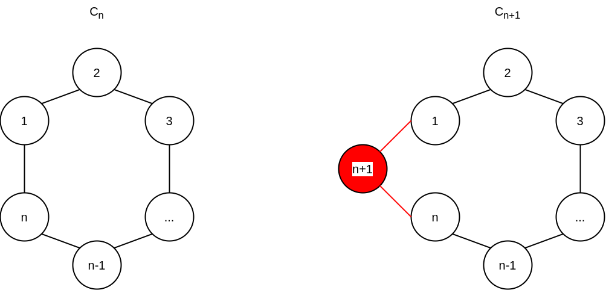
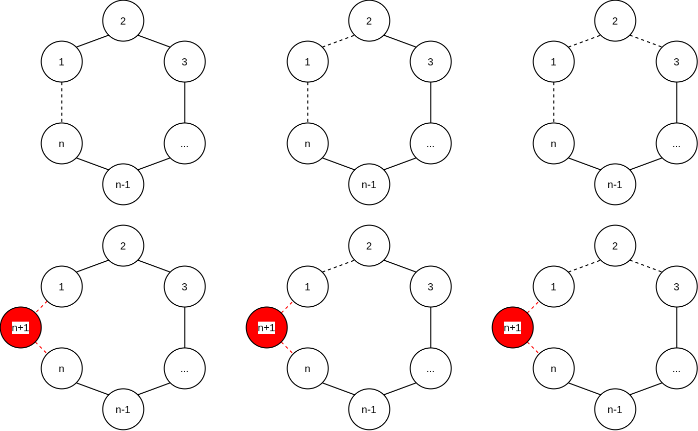
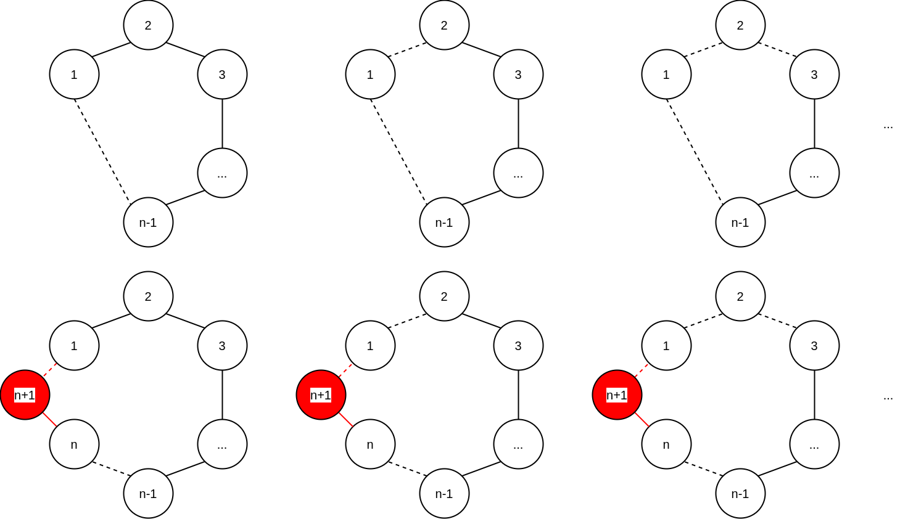

**Problme No:** 03644
**Problem Id:** 그래프 매칭

일단 문제 해설에 앞서서 중요한 사실을 미리 밝히면, 이 문제의 답 범위는 64bit integer를 아득히 초과한다.

답을 계산하기 위한 BigInteger 클래스는 미리 만들어야 함에 주의하자.

아래 설명에서는 BigInteger는 이미 구현했다고 가정하고, 코어가 되는 알고리즘에 대해서만 설명한다.

문제는 DP로 접근한다.

`C_(n)`을 그려본 뒤에 `C_(n+1)`을 그려보자.

이 때, 정점 `n+1`에 의해서 그래프에 추가된 간선은 아래 그림의 적색과 같이 `(n, n+1)`, `(n+1, 1)`이 될 것이다.

이제 `C_(n+1)`의 매칭 수를 헤아리는데, 아래와 같이 경우를 나누어 생각해보자.

매칭의 정의에 의해 `(n, n+1)`, `(n+1, 1)`을 모두 포함할 수는 없고(`n+1`을 두번 포함하게 되므로), 따라서 자명하게 `C_(n+1)`의 매칭 수는 아래 3가지 케이스의 합이 될 것이다.

- **Case1)** `(n, n+1)`, `(n+1, 1)` 모두를 포함하지 않는 매칭의 수
- **Case2)** `(n, n+1)`만 포함하는 매칭의 수
- **Case3)** `(n+1, 1)`만 포함하는 매칭의 수

**Case 1)** 의 경우에는 `C_(n)`에 존재하는 매칭들 중 `(n, 1)`을 포함하지 않는 매칭들의 수와 같음을 알 수 있다.

아래 그림이 보이듯이, `(n, 1)`을 포함하지 않았던 매칭들에 단순히 `(n, 1)`을 `(n, n+1)`, `(n+1, 1)`로 바꿔치기 해놓으면 되기 때문이다.

이 때, `(n, n+1)`, `(n+1, 1)` 모두 선택되지 않는 간선임에 주의하자.

**Case 2)** 의 경우에는 `C_(n)`에 존재하는 매칭들 중 정점 `n`을 포함하지 않는 매칭들의 수와 같음을 알 수 있다.

그런데, 정점  `C_(n)`에서 정점 `n`을 포함하지 않는 매칭들의 수는 곧 `C_(n-1)`에서 `(n-1, 1)`을 포함하지 않는 매칭들의 수와 같다.

아래 그림이 보이듯이, `(n-1, 1)`을 포함하지 않았던 매칭들에 단순히 `(n-1, 1)`을 `(n, n+1)`, `(n+1, 1)`, `(n-1, n)`로 바꿔치기 해놓으면 되기 때문이다.

이 때, `(n, n+1)`은 선택된 간선, `(n+1, 1)`, `(n-1, n)`은 선택되지 않는 간선임에 주의하자.

**Case 3)** 역시 **Case 2)** 와 유사하게 `C_(n)`의 매칭들 중 정점 `1`을 포함하지 않은 매칭의 수와 같음을 알 수 있다.

따라서, Case 2)와 유사한 논리의 진행이 가능한데 여기서 하나 잘 생각해볼 포인트가 있다.

주어지는 그래프는 굉장히 특이한 환형의 그래프이므로 정점 `1`을 포함하지 않는 경우의 수나, 정점 `2`를 포함하지 않는 경우의 수나..., 특정한 하나의 정점을 포함하지 않는 경우의 수는 모두 같을 수 밖에 없다.

따라서, Case 3)의 매칭 수는 Case 2)의 매칭 수와 같다.

아이디어를 DP로 옮기기 위한 CACHE의 정의는 아래와 같다.

- `CACHE[n][0]`: `C_(n)`에서 간선 `(n, 1)`을 포함하지 않는 매칭의 수
- `CACHE[n][1]`: `C_(n)`에 존재하는 매칭의 수

점화식을 세우면 아래와 같다.

- `CACHE[n+1][0]` = `CACHE[n][0] + CACHE[n-1][1]` // Case 1) + Case 3)
- `CACHE[n+1][1]` = `CACHE[n][0] + 2 * CACHE[n-1][0]` // Case 1) + Case 2) + Case 3)
